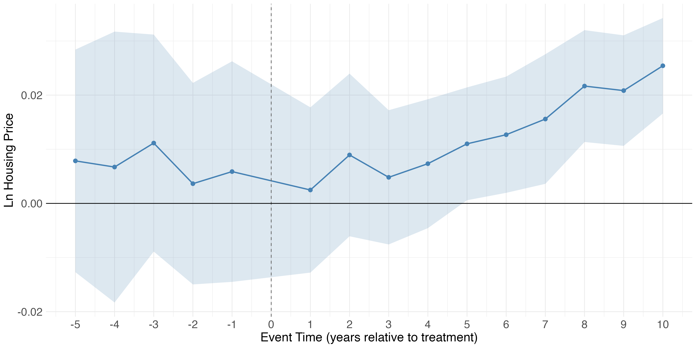
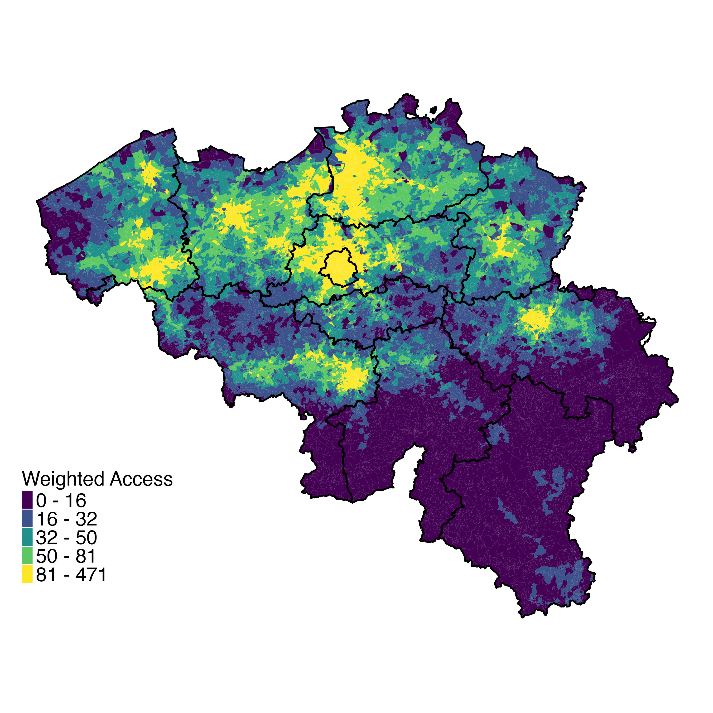
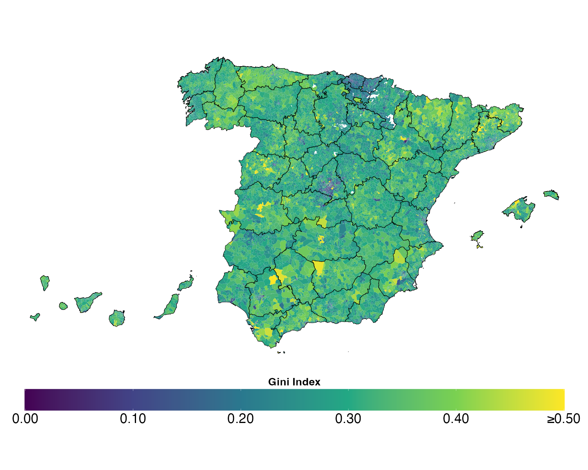

```{=html}
<style>
figcaption {
  text-align: center;
  color: black;
}
</style>
```

::: {style="margin-top: 4em;"}
## **Job Market Paper**
:::

:::::: columns
::: {.column width="55%"}
-   [The Value of Local Public Goods: Evidence from Massachusetts’ Property Tax Limits](working_papers/Mariani_JMP.pdf)

    <details>

    <summary>Abstract</summary>

    This paper quantifies households' willingness-to-pay for local public goods using Massachusetts' Proposition 2½, which caps annual property tax increases but permits voter-approved overrides to finance specific projects. Using a novel dataset of all proposed tax overrides from 2001–2023, we implement a dynamic regression discontinuity design that leverages close-margin elections. We find that passing an override causes a sustained 2.8% increase in housing prices over ten years. This estimate rises to 4% in a boundary discontinuity design comparing adjacent properties across municipal borders, controlling for unobserved neighborhood characteristics. We show this capitalization is driven by an influx of higher-income households attracted by improved public services. Consistent with this mechanism, overrides lead to a 3.5% increase in per-pupil spending and a cumulative 25% increase in teacher expenditures, while the enrollment share of low-income students simultaneously declines. A back of the envelope computation reveals that homeowners are willing to pay approximately \$2 in present value for each \$1 of override-funded spending.

    </details>
:::

::: {.column width="5%"}
<!-- empty column for spacing -->
:::

::: {.column width="40%"}

:::
::::::

::: {style="margin-top: 4em;"}
## **Working Papers**
:::

:::::: columns
::: {.column width="55%"}
-   [Do Public Goods Actually Reduce Inequality?](working_papers/public_goods.pdf) (*with* [*M. Castanheira*](https://sites.google.com/site/micaelcastanheiraswebsite/) & [*C. Tricaud*](https://www.clemence.tricaud.com/research))

    <details>

    <summary>Abstract</summary>

    Public goods are meant to be universal, but they are inherently place-based. This paper systematically measures spatial access to public goods and quantifies the implications of distance to public facilities for income inequality. First, we map all schools and hospitals across Belgium. We compute the distance to facilities for each of the 20,000 neighborhoods and document large spatial inequalities in access to public facilities. Second, we find that this unequal distribution favors high-income neighborhoods: allocating public goods spending proportionally to our access index increases income inequality compared to measures based solely on disposable income. Third, we show that the positive relationship between income and access can be rationalized by a simple model of public goods allocation with an inequality-neutral social planner. Finally, we provide evidence that access is strongly correlated with educational and health outcomes, emphasizing the need to consider the place-based nature of public goods when measuring inequality.

    </details>
:::

::: {.column width="5%"}
:::

::: {.column width="40%"}
{width="80%"}
:::
::::::

:::::: columns
::: {.column width="55%"}
-   [Housing inequality in Spain](working_papers/Housing_inequality_Spain.pdf) (*with* [*G. Domènech Arumí*](https://sites.google.com/site/domenechweb/home))\
    **Download the data**: [WHID Data](https://doi.org/10.7910/DVN/HONBNB)

    <details>

    <summary>Abstract</summary>

    We use data on the universe of real estate in Spain and recent real estate transactions in Catalonia to construct novel contemporaneous and long-run housing inequality estimates for Spain at all existing levels of aggregation. Housing inequality in Spain is large, with the top 1% most spacious and valuable dwellings accruing over 6% of total residential space (square meters) and value. These estimates put Spain in between the US and Belgium in terms of inequality. Long-run series show that space inequality was much higher at the beginning of the 20th Century and declined significantly in the 1960s, coinciding with a boom in housing supply. Housing value inequality increased between 2009 and 2019, likely due to cyclical changes in aggregate demand and stagnating new housing supply. We document significant heterogeneity across all levels of aggregation and a correlation between housing value and income inequality, suggesting a connection between the two. This research introduces a new publicly available database to study housing-related topics and highlights the importance of granularity when evaluating policies related to inequality and housing.

    </details>
:::

::: {.column width="5%"}
:::

::: {.column width="40%"}

:::
::::::

::: {style="margin-top: 4em;"}
## **Work in Progress**
:::

:::::: columns
::: {.column width="55%"}
-   Housing inequality in the US (*with* [*G. Domènech Arumí*](https://sites.google.com/site/domenechweb/home) & [*L. Ma*](https://leima-econ.com/))

    <details>

    <summary>Abstract</summary>

    We study housing inequality in the United States (US). Using administrative data on the universe of real estate in the US, we produce novel housing inequality estimates at all levels of aggregation (country, state, MSA, census tract, census block group, and census block) and over time. Dispersion in house values is high (Gini of 0.59) and highly heterogeneous across geographies, with significantly higher inequality in the coastal states. Housing (space) inequality is also high (Gini of 0.64) and exhibits similar geographic patterns to value inequality. Housing wealth inequality is even higher (Gini of 0.79), especially in cities. Our estimates reveal a close link between housing value inequality and (nominal) income inequality and between space inequality and real (net of housing costs) inequality. They also reveal similarities between housing wealth and wealth inequality. Our results and data, which will be publicly available as part of the World Housing Inequality Database (WHID), highlight the extent to which housing inequality estimates can supplement or substitute traditional income and wealth inequality estimates, particularly when these are not readily available or in highly granular settings.

    </details>
:::

::: {.column width="5%"}
:::

::: {.column width="40%"}
:::
::::::

::: {style="margin-top: 4em;"}
## **Publications**
:::

:::::: columns
::: {.column width="55%"}
-   [Des Biens Publics pas si Publics que Ça](https://www.racine.be/fr/in%C3%A9galit%C3%A9s-en-belgique-un-paradoxe) (*with* [*M. Castanheira*](https://sites.google.com/site/micaelcastanheiraswebsite/)) in Decoster, A., Decancq, K., De Rock, B., and P. Gobbi (eds.) (2024), Inégalités en Belgique. Un paradoxe, Editions Racine, Bruxelles
:::

::: {.column width="5%"}
:::

::: {.column width="40%"}
{width="30%"}
:::
::::::
